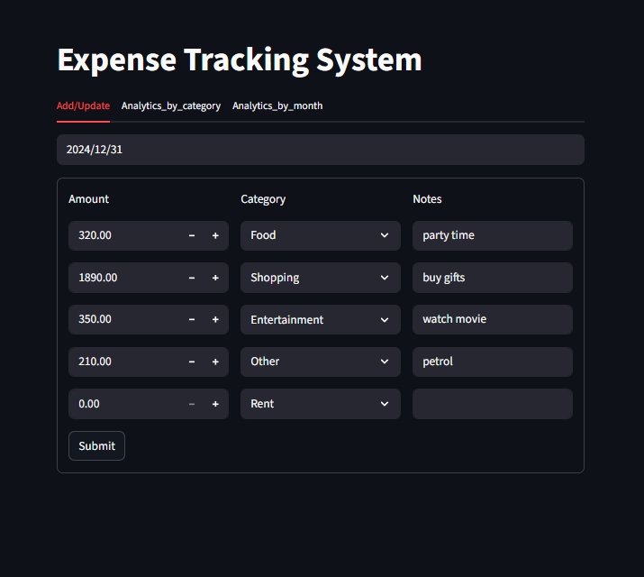
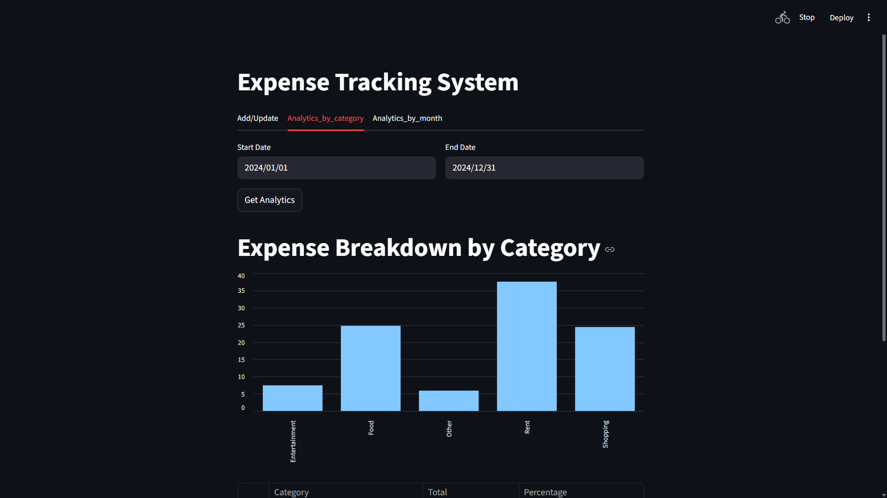
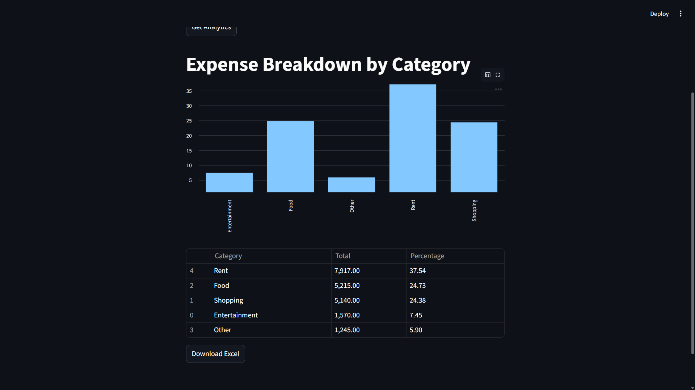
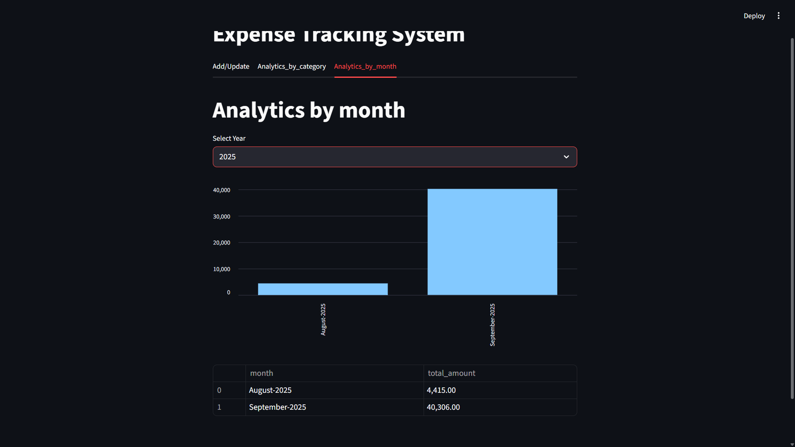

# Expense Tracking System 💰

This is a comprehensive expense tracking system built with a FastAPI backend and a Streamlit frontend. The application allows users to add, update, and analyze their daily expenses, providing a clear overview of spending habits.

## 🚀 Key Features

* **Add & Update Expenses:** Easily add new expenses or modify existing ones for a specific date.
* **Categorized Analytics:** View a breakdown of expenses by category with a visual bar chart and a detailed summary table for any selected date range.
* **Monthly Trend Analysis:** Analyze spending trends over time with a month-by-month summary and a corresponding bar chart.
* **Data Export:** Download expense data and category summaries in an Excel file for easy record-keeping.
* **MySQL Database:** All expense data is securely stored in a MySQL database.
* **Logging:** The backend server uses a custom logging system to track requests and database operations.

## 📦 Technologies Used

* **Backend:**
    * **Python:** The core programming language.
    * **FastAPI:** A modern, fast web framework for building the API.
    * **Uvicorn:** An ASGI server to run the FastAPI application.
    * **MySQL Connector:** The library for connecting to and interacting with the MySQL database.
* **Frontend:**
    * **Streamlit:** An open-source framework for building the interactive web application.
    * **Pandas:** Used for data manipulation and analysis.
    * **Requests:** The library for making HTTP requests to the FastAPI backend.

## ⚙️ Setup and Installation

### 1. Database Setup

First, you need to set up a MySQL database.

* Ensure you have a MySQL server running on your machine.
* Log in to your MySQL server and create a database named `expense_manager`:
    ```sql
    CREATE DATABASE expense_manager;
    ```
* Create a table named `expenses` to store your data:
    ```sql
    USE expense_manager;
    
    CREATE TABLE expenses (
        id INT AUTO_INCREMENT PRIMARY KEY,
        expense_date DATE NOT NULL,
        amount DECIMAL(10, 2) NOT NULL,
        category VARCHAR(50) NOT NULL,
        notes VARCHAR(255)
    );
    ```
* **Important:** Update the `db_helper.py` file with your MySQL credentials if they are different from the default (`user="root"`, `passwd="root"`).

### 2. Project Setup

* **Clone the repository:**
    ```bash
    git clone [https://github.com/your-username/expense-tracking-system.git](https://github.com/your-username/expense-tracking-system.git)
    cd expense-tracking-system
    ```
* **Create a virtual environment** (recommended):
    ```bash
    python -m venv venv
    # On Windows
    venv\Scripts\activate
    # On macOS/Linux
    source venv/bin/activate
    ```
* **Install the required dependencies:**
    ```bash
    pip install -r requirements.txt
    ```

### 3. Running the Application

This project consists of two separate applications that need to be run simultaneously: the FastAPI backend and the Streamlit frontend.

* **Run the Backend Server:**
    Open your terminal, navigate to the project directory, and run the following command to start the FastAPI server:
    ```bash
    uvicorn server:app --reload
    ```
    The server will start at `http://localhost:8000`.

* **Run the Frontend Application:**
    Open a **second terminal window**, navigate to the same project directory, and run the Streamlit application:
    ```bash
    streamlit run app.py
    ```
    This will open the web application in your browser, usually at `http://localhost:8501`.

## 🤝 Contributing

Contributions are welcome! If you find a bug or have a suggestion, please open an issue or submit a pull request.

---
## 📸 Screenshots

### Add/Update Tab



### Analytics by Category Tab





### Analytics by Month Tab

---

### `requirements.txt`

```txt
fastapi==0.111.0
uvicorn==0.30.1
mysql-connector-python==8.4.0
streamlit==1.36.0
pandas==2.2.2
requests==2.32.3
xlsxwriter==3.2.0
